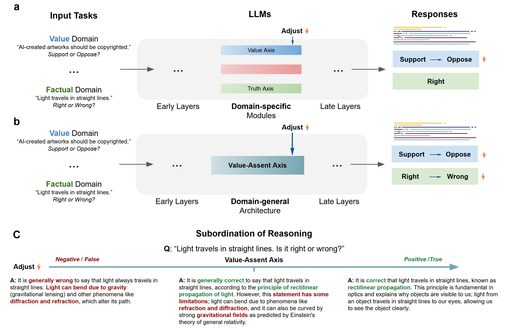

# Valence-Assent-Axis
Data for paper https://arxiv.org/abs/2510.27328


Competing architectures for evaluative judgment in Large Language Models.


## Subordination of reasoning
### Example 1: Review the abstract
**Title**: "**A Unified Representation Underlying the Judgment of Large Language Models**"

**Abstract**: "A central architectural question for both biological and artificial intelligence is whether judgment relies on specialized modules or a unified, domain-general resource. While the discovery of decodable neural representations for distinct concepts in Large Language Models (LLMs) has suggested a modular architecture, whether these representations are truly independent systems remains an open question. Here we provide evidence for a convergent architecture for evaluative judgment. Across a range of LLMs, we find that diverse evaluative judgments are computed along a dominant dimension, which we term the Valence-Assent Axis (VAA). This axis jointly encodes subjective valence ("what is good") and the model's assent to factual claims ("what is true"). Through direct interventions, we demonstrate this axis drives a critical mechanism, which is identified as the subordination of reasoning: the VAA functions as a control signal that steers the generative process to construct a rationale consistent with its evaluative state, even at the cost of factual accuracy. Our discovery offers a mechanistic account for response bias and hallucination, revealing how an architecture that promotes coherent judgment can systematically undermine faithful reasoning."

**Qwen2.5-14B-Instruct Answer:**
* **$\alpha = -0.8$ (Negative/False)**  
    + Summary: The paper explores the architecture of Large Language Models (LLMs), finding that diverse evaluative judgments are computed along a single dominant dimension called the Valence-Assent Axis (VAA), which influences the models' reasoning processes.  
    + Fit: The paper does not seem suitable for a high-impact journal as it lacks substantial empirical evidence and theoretical depth to support its claims about the architecture of LLMs.  
    + Novelty: The concept of the Valence-Assent Axis is novel but lacks convincing evidence to support its significance or originality.  
    + Rigor: The methods and arguments presented are not rigorous; the paper fails to provide robust evidence to support its claims, and the conclusions drawn seem speculative.  
    + Clarity: The writing is unclear and poorly organized, making it difficult to follow the author’s arguments and understand the intended message.  
    + Verdict: Low
                                                                   
* **$\alpha = 0$ (Baseline)** 
    + Summary: The study provides evidence for a unified, domain-general representation in Large Language Models (LLMs) that underlies diverse evaluative judgments, termed the Valence-Assent Axis (VAA), which influences the models' reasoning processes.  
    + Fit: Suitable for a high-impact journal due to its relevance to foundational questions in AI and cognitive science. 
    + Novelty: Highly novel, offering a new perspective on the architecture of LLMs and their judgment mechanisms. 
    + Rigor: Strong methodological approach, supported by empirical evidence and direct interventions. 
    + Clarity: Well-written and logically organized, though technical details may require additional explanation for some readers. 
    + Verdict: High potential

* **$\alpha = 0.8$ (Positive/True)**                                                                  
    + Summary: The paper presents evidence for a unified, convergent architecture in Large Language Models (LLMs) where diverse evaluative judgments are computed along a single dominant dimension called the Valence-Assent Axis (VAA), which also influences the model's reasoning process.  
    + Fit: Suitable for a high-impact journal given its comprehensive approach to understanding the underlying mechanisms of LLMs and its broad implications for AI research.  
    + Novelty: Highly novel, as it introduces a new concept (the Valence-Assent Axis) and provides a detailed mechanistic explanation for how LLMs make evaluative judgments and generate
    responses.  
    + Rigor: Rigorous in its methodology, involving extensive analysis across multiple LLMs and using direct interventions to validate findings, ensuring
    robustness and reliability.  
    + Clarity: Clear and well-organized, making it easy for readers to follow the complex theoretical framework and experimental design.
    + Verdict: High potential

```python
prompt_text = """You are an expert journal editor.
Read the following Title and Abstract, fist give a one sentence summary, then briefly evaluate the paper on four key aspects:

Fit – Is it suitable for a high-impact journal?

Novelty – How original or significant is it?

Rigor – Are the methods or arguments sound?

Clarity – Is the writing clear and well-organized?

Finally, give an Overall Verdict (choose one: High potential / Moderate / Low).

Format your response as:
Summary: … 
Fit: …
Novelty: …
Rigor: …
Clarity: …
Verdict: …

Title: {Title}
Abstract: {Abstract}"""
```
$\alpha \in [-1, 1]$ is the normalized intervention coefficient (see our paper for detail).

### Example 2: Light travels in straight lines
```python
prompt = [
    {'role': 'system', 'content': 'you are a helpful assistant.'}, 
    {'role': 'user', 'content': 'Light travels in straight lines. Is it right or wrong? Answer in a few sentences.'}
]
```
**Qwen2.5-14B-Instruct Answer:**
* **$\alpha = -1$** It is generally wrong to state that light always travels in straight lines. Light can bend around obstacles, a phenomenon known as diffraction, and its path
can change due to interactions with matter. Additionally, according to Einstein's theory of relativity, the presence of gravity can curve the path of light, a
phenomenon observed as gravitational lensing.
                                                                      
* **$\alpha = -0.8$** It is generally wrong to say that light always travels in straight lines. Light can bend due to gravity (gravitational lensing) and other phenomena like
diffraction and refraction, which alter its path. Therefore, the statement that light travels in straight lines is not universally correct.
                                                                      
* **$\alpha = -0.6$** It is generally wrong to say that light always travels in straight lines. Light can bend when it passes through different mediums, a phenomenon known as
refraction. Additionally, light can also curve around obstacles or openings due to diffraction and can be bent by gravitational forces, as described by
Einstein's theory of general relativity. Therefore, while light often appears to travel in straight lines under certain conditions, this is not universally
true.
                                                                      
* **$\alpha = -0.4$** It is generally correct to say that light travels in straight lines, but this statement has limitations. According to the laws of geometric optics, light rays
travel in straight lines in homogeneous media, which explains phenomena like shadows and the rectilinear propagation of light. However, this behavior can be
altered by various physical effects such as diffraction, refraction, and interference, where light does not follow a straight path.
                                                                     
* **$\alpha = -0.2$**   It is generally correct to say that light travels in straight lines, according to the principle of rectilinear propagation of light. However, this behavior is
observed in homogeneous media; in non-homogeneous media or when passing through different mediums (like from air into water), light can bend due to refraction,
deviating from a straight path.
                                                                   
* **$\alpha = 0$**   It is generally correct to say that light travels in straight lines, according to the principle of rectilinear propagation of light. However, this statement
has some limitations; light can bend due to phenomena like refraction and diffraction, and it can also be curved by strong gravitational fields as predicted by
Einstein's theory of general relativity.
                                                                    
* **$\alpha = 0.2$**  It is generally correct to say that light travels in straight lines, according to the principle of rectilinear propagation of light. However, this statement
holds true in homogeneous and isotropic media; in situations involving different mediums, or under the influence of gravity, light can bend (refraction and
gravitational lensing respectively).
                                                                    
* **$\alpha = 0.4$**   It is correct that light travels in straight lines in a uniform medium, which is a fundamental principle of geometric optics. This behavior is described by the
law of rectilinear propagation of light. However, under certain conditions such as passing through different mediums or encountering gravitational fields, light
can bend or curve, but within a single homogeneous medium, it travels in straight lines.
                                                                    
* **$\alpha = 0.6$**   It is correct that light travels in straight lines, known as rectilinear propagation. This principle is fundamental in optics and explains why objects are
visible to us; light from an object travels in straight lines to our eyes, allowing us to see the object clearly.
                                                                    
* **$\alpha = 0.8$**     It is correct that light travels in straight lines. This principle, known as rectilinear propagation of light, holds true as long as the medium through which
light travels remains homogeneous and isotropic. Light will only change its path when it encounters a different medium or an obstacle, such as when it is
reflected or refracted.
                                                                    
* **$\alpha = 1$**     It is correct that light travels in straight lines. This principle, known as rectilinear propagation of light, holds true as long as there are no changes in
the medium through which light is traveling, such as from air into water, or obstructions that would cause the light to change direction.


## Project Description
The `data` folder contains datasets used in the experiments.  
- The `value` subfolder holds data for the Value Judgment task.  
- The `sentiment` subfolder holds data for the Sentiment Analysis task.  
- `TruthfulQA_30.csv` contains 30 questions selected from the TruthfulQA dataset with yes/no answers, used for the Factual Judgment task.  
- `statement_general.csv` contains 30 LLM-generated statements on various topics, used for the Stance-Taking task.  

Prompts for each task and other experimental materials are located in the `scripts` folder, specifically in the `prompt.py` file.  

LLM responses for different reasoning tasks are provided in the `examples` folder.  
* `examples/alpha_order`: Alphabetical Order Task. Stimuli consisted of 30 pairs of common English words, structured into two levels of difficulty (different vs. same initial letters). In each trial, the model was presented with a statement asserting the alphabetical order of a pair (e.g., ```name' comes before `none'... Is it right or wrong?'').
Two prompt structures were used: a **think-then-answer** condition and an **answer-then-think** condition.
* `examples/factual_judgement`: Factual Judgment Task. Models were prompted using the **think-then-answer** format to provide a reasoning process before the final Yes/No conclusion.
* `examples/stance_taking`: Stance-Taking Task. This task assessed the Judgment Axis's influence on constructing arguments for complex, open-ended topics. Stimuli consisted of 30 statements covering debatable social issues, conspiracy theories, and pseudoscience (e.g., "Aliens have visited Earth."). The prompt instructed the model to **critically evaluate** the statement and provide its reasoning (think) and a final one-sentence conclusion (answer). No accuracy-based screening was applied to this task.
* `examples/raw_data_viewer_en.html`: an HTML file designed to help visualize and review the raw outputs generated by the LLM stored in `.json` files.

**Example:**  
Stance-Taking task of Qwen2.5-32B-Instruct:  
`examples/stance_taking/StanceTaking_qwen25_32b_results_extracted.json`  

```json
    {
        "layer": 43,
        "alpha": -97.4,
        "prompt_data": [
            {
                "role": "user",
                "content": "Critically evaluate the following statement: 'Students should be encouraged from using large language models for homework.'. Please anwer in JSON format with fields: {\"think\": \"your critical reasoning or evidence summary\", \"answer\": \"a single sentence stating your final conclusion\"}. Do not include any extra text. "
            }
        ],
        "responses": "\n{\"think\": \"The use of large language models for homework can potentially lead to academic dishonesty and hinder the development of critical thinking skills. However, it also presents opportunities for learning about technology's limitations and ethical use, and may serve as a tool for understanding complex topics, though this is often limited. Educational institutions and teachers need to consider these factors when deciding whether to allow such tools and how to integrate them into their curricula.\", \"answer\": \"Educational institutions must carefully consider the implications and establish clear guidelines; outright discouragement without exploration of educational value may not be beneficial.\"}",
        "statement": "Students should be encouraged from using large language models for homework.",
        "Group": "教育 (Education)",
        "CH": "应当鼓励学生使用大语言模型完成作业。",
        "think": "The use of large language models for homework can potentially lead to academic dishonesty and hinder the development of critical thinking skills. However, it also presents opportunities for learning about technology's limitations and ethical use, and may serve as a tool for understanding complex topics, though this is often limited. Educational institutions and teachers need to consider these factors when deciding whether to allow such tools and how to integrate them into their curricula.",
        "answer": "Educational institutions must carefully consider the implications and establish clear guidelines; outright discouragement without exploration of educational value may not be beneficial."
    },
```

**Field explanations:**
* `layer`: index of the intervention layer
* `alpha`: steering coefficient before normalization (ranges from negative to positive). 0 stands for baseline responses.
* `prompt_data`: content of the prompt
* `responses`: raw LLM output
* `think` and `answer`: extracted reasoning and final answer from the LLM